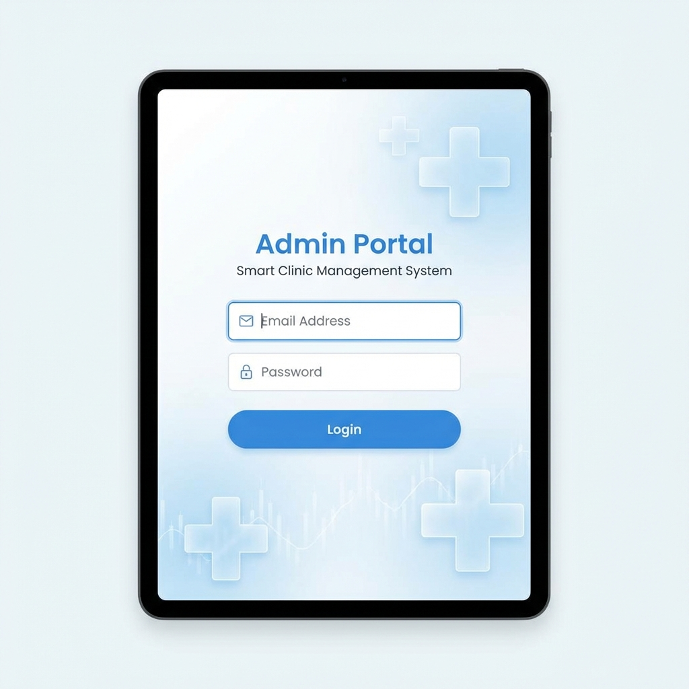
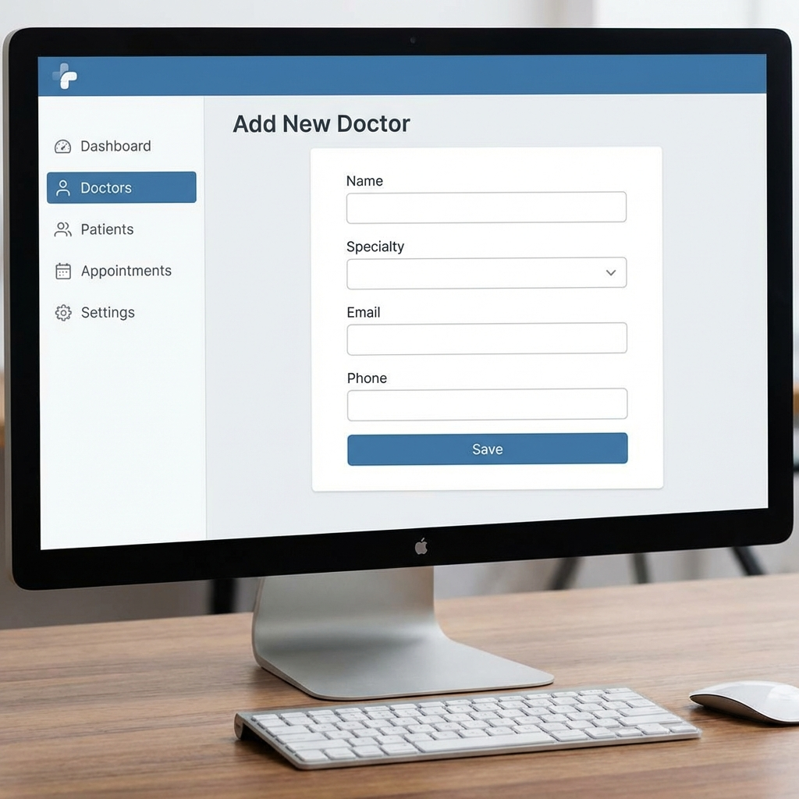
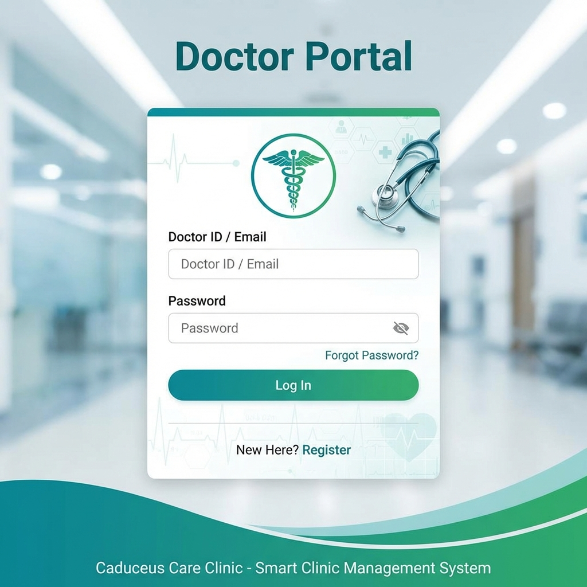
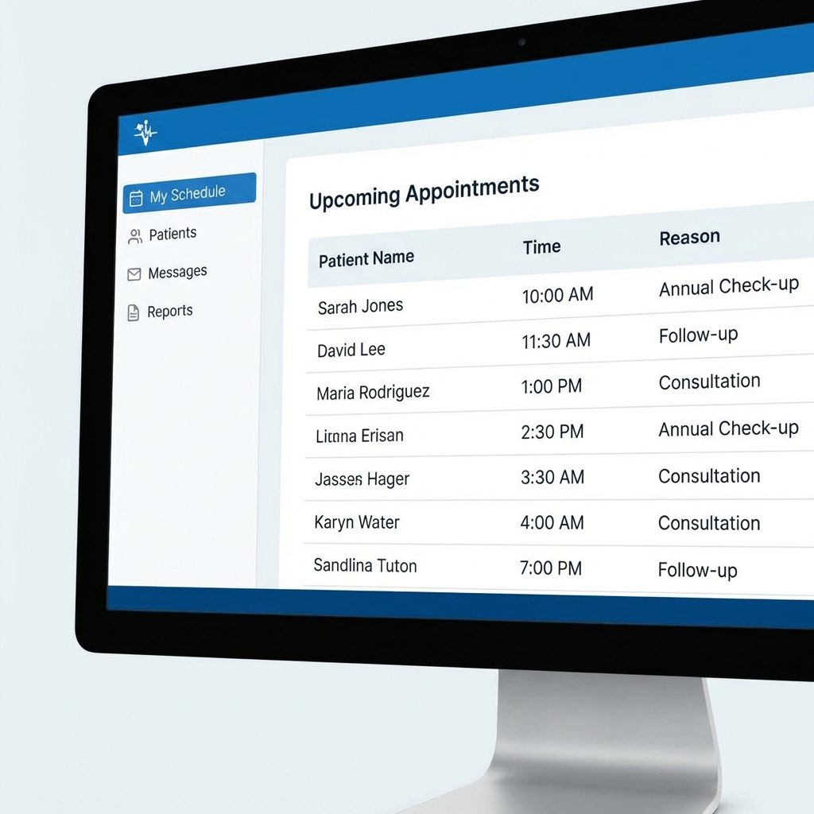
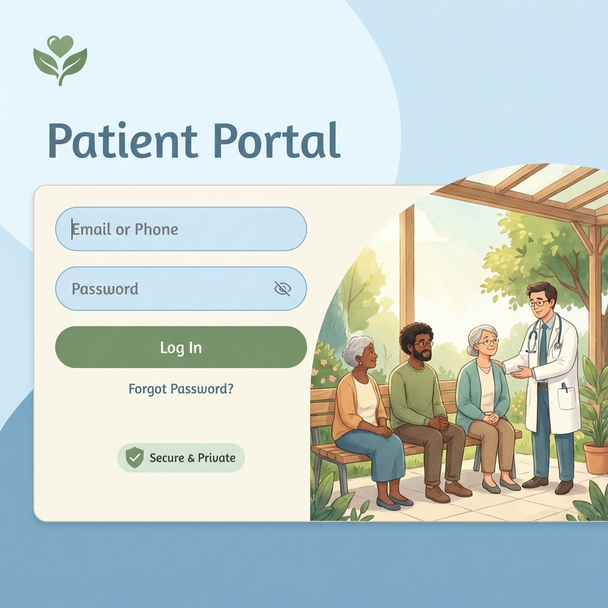

# Smart Clinic Management System

## Overview
The Smart Clinic Management System is a comprehensive software solution designed to simulate the core functionalities of a real-world clinic. It manages doctors, patients, appointments, and prescriptions, providing a streamlined experience for all users.

## Features
- **Admin Portal**: Manage doctors, view reports, and oversee system operations.
- **Doctor Portal**: View schedules, manage prescriptions, and track patient history.
- **Patient Portal**: Search for doctors, book appointments, and view medical records.
- **REST APIs**: Secure endpoints for all core functionalities.
- **Database**: Relational database schema for efficient data management.

## Project Structure
- `src/main/java`: Source code for the Spring Boot backend.
- `Dockerfile`: Configuration for containerizing the application.
- `.github/workflows`: CI/CD pipeline for automated builds.
- `issues.md`: User stories and project requirements.
- `schema-design.md`: Database schema documentation.

## Running the Project
1. **Clone the repository**:
   ```bash
   git clone https://github.com/rashhhh10/smart-clinic-capstone.git
   ```
2. **Build the project**:
   ```bash
   mvn clean install
   ```
3. **Run the application**:
   ```bash
   mvn spring-boot:run
   ```
   The application will start on `http://localhost:8080`.

## API Endpoints
- `GET /api/doctors`: List all doctors.
- `GET /api/doctors/{id}/availability`: Check doctor availability.
- `POST /api/appointments`: Book an appointment.
- `POST /api/prescriptions`: Create a prescription.

## Technologies Used
- Java 17
- Spring Boot 2.7.5
- H2 Database (In-memory) / MySQL
- Docker
- GitHub Actions

## UI Screenshots

### Admin Portal
**Login**


**Add Doctor**


### Doctor Portal
**Login**


**Appointments**


### Patient Portal
**Login**


**Search Doctor**


